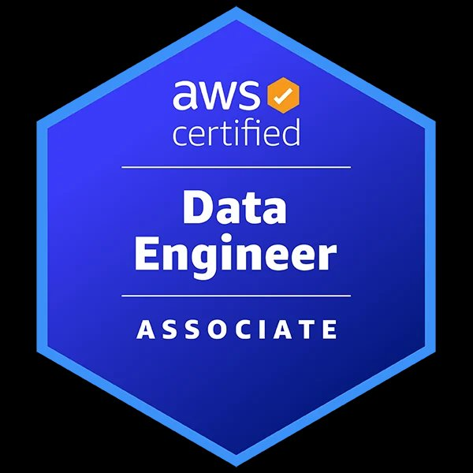

<div align="center">

<!-- HEADER BANNER -->


<!-- TYPING ANIMATION -->
<a href="https://git.io/typing-svg"></a>

<br/>

<!-- SOCIAL BADGES -->
[](https://www.linkedin.com/in/sri-gayathri-sahithi-morapakala-845124170/)
[](https://medium.com/@saisahithi2001)
[](mailto:saisahithi2001@gmail.com)
[](https://github.com/SriGayathri06)

</div>

---

## 🧭 About Me

```yaml
name: Sri Gayathri Sahithi Morapakala
location: Seattle, WA
education: MS Data Science, 2025
current_focus: Cloud Data Engineering & Full-Stack BI
previously_at: [Deloitte, Third Estate Analytics]
superpower: Turning messy data into pipelines that scale — and dashboards that tell the story
fun_fact: I blog about the things I get wrong first, so others don't have to
```

I'm a **Cloud Data Engineer** who builds end-to-end — from raw ingestion to executive dashboards. I care about data quality, pipeline reliability, and making insights *actually* accessible to decision-makers. Currently seeking roles where I can architect data systems that matter.

---

## 🏅 Certifications

<div align="center">

<a href="https://www.credly.com/badges/c799c44c-54df-41c7-8a16-0805b0e7a0c5">

</a>
&nbsp;&nbsp;&nbsp;&nbsp;&nbsp;&nbsp;&nbsp;&nbsp;
<a href="https://learn.microsoft.com/api/credentials/share/en-in/SriGayathriSahithiMorapakala-5979/21D4C6EB0BBFD07B?sharingId=4D357618E8D6E49D">

</a>

<br/>

**AWS Certified Data Engineer – Associate (DEA-C01)** &nbsp;&nbsp;•&nbsp;&nbsp; **Microsoft Fabric Data Engineer Associate (DP-700)**

_Click the badges above to verify_

</div>

---

## 🛠️ Tech Stack

<div align="center">

| **Domain** | **Technologies** |
|:---|:---|
| **Cloud & Infra** |     |
| **Data Engineering** |     |
| **BI & Visualization** |    |
| **Backend & APIs** |    |
| **ML & AI** |    |
| **DevOps & Tools** |    |

</div>

---

## 🚀 Featured Projects

### ☁️ Cloud Data Engineering

<table>
<tr>
<td width="50%">

#### 🧬 [Pharma Data Quality Pipeline](https://github.com/SriGayathri06/pharma-dq)
**AWS CDK · TypeScript · Azure Pipelines · S3 · Lambda**

Production-grade data quality framework for pharmaceutical data built entirely from scratch using Infrastructure-as-Code. Designed to validate, cleanse, and route pharma datasets through automated pipelines — no drag-and-drop tools involved.

📝 **Blog:** [Will Drag-and-Drop Pipelines Survive Production?](https://medium.com/@saisahithi2001/will-drag-and-drop-data-pipelines-survive-production-i-built-the-answer-from-scratch-b97ee09bed2a)

</td>
<td width="50%">

#### 🏟️ [AthleteSphere — Sports Data Platform](https://github.com/SriGayathri06/AthleteSphere---Sports-Data-Management-for-Enhanced-Analysis-and-Predictive-Modeling)
**SQL · Data Modeling · Predictive Analytics · Python**

End-to-end sports data management system — from schema design to predictive modeling. Built for enhanced analysis of athlete performance with normalized data models and ML-powered forecasting.

</td>
</tr>
</table>

### 📊 Business Intelligence & Dashboards

<table>
<tr>
<td width="100%">

#### 📈 [BI Dashboard Portfolio](https://github.com/SriGayathri06/Dashboards_DataAnalytics-Business-Intelligence)
**Tableau · Power BI · SQL · DAX**

A collection of 3 interactive, stakeholder-ready dashboards:

| Dashboard | Tool | What It Does |
|:---|:---|:---|
| **HR Analytics** | Tableau | 360° workforce view — compensation, demographics, leave patterns, retention risks |
| **Sales Performance** | Tableau | Global sales tracking across 6 countries, top-rep leaderboards, $6.1M pipeline KPIs |
| **Finance KPI** | Power BI | Executive snapshot with DAX-driven EBITDA margins, YOY trends, drill-down by department |

</td>
</tr>
</table>

### 🤖 Machine Learning & AI

<table>
<tr>
<td width="33%">

#### 🍷 [Wine Quality ML](https://github.com/SriGayathri06/wine-quality-ml-analysis)
Regression & classification models for predicting wine quality scores

</td>
<td width="33%">

#### 🔤 [Word Clustering](https://github.com/SriGayathri06/Word-Clustering)
NLP-based word clustering using embedding techniques & unsupervised learning

</td>
<td width="34%">

#### 🧠 [Advanced CNN Engineering](https://github.com/SriGayathri06/Advanced-ML-Engineering-for-Convolutional-Networks)
Deep dive into convolutional network architectures & optimization techniques

</td>
</tr>
<tr>
<td colspan="3">

#### 🔬 [Self-Supervised Feature Learning](https://github.com/SriGayathri06/Self-supervised-feature-learning-for-image-classification)
Self-supervised pre-training methods for image classification — exploring representation learning without labeled data

</td>
</tr>
</table>

### ⚙️ Software Engineering

<table>
<tr>
<td width="100%">

#### 💼 [JobBoardX — REST API Template](https://github.com/SriGayathri06/jobboardx) &nbsp; ⭐ 4
**Spring Boot · MongoDB · Atlas Search · Swagger · Maven**

Production-style microservices API with pagination, validation, full-text search via MongoDB Atlas, and Swagger docs. Designed as a reusable template for REST API development.

📝 **Blog:** [The Universal Template for REST APIs](https://medium.com/@saisahithi2001/the-universal-template-for-rest-apis-4cf189e12158)

</td>
</tr>
</table>

---

## ✍️ Latest from Medium

<!-- BLOG POSTS -->
| # | Article |
|:--|:--------|
| 1 | 🔧 [Will Drag-and-Drop Data Pipelines Survive Production? I Built the Answer from Scratch](https://medium.com/@saisahithi2001/will-drag-and-drop-data-pipelines-survive-production-i-built-the-answer-from-scratch-b97ee09bed2a) |
| 2 | 💡 [I Was Asked to Build a Data Pipeline on My First Week — Here Is Everything I Got Wrong First](https://medium.com/@saisahithi2001/i-was-asked-to-build-a-data-pipeline-on-my-first-week-here-is-everything-i-got-wrong-first-f557766171ad) |
| 3 | 🧩 [The Universal Template for REST APIs](https://medium.com/@saisahithi2001/the-universal-template-for-rest-apis-4cf189e12158) |

---

## 🏆 Professional Highlights

```
📌 At Third Estate Analytics — Architected and delivered an end-to-end data pipeline
   for a fast-growing analytics startup, designing ingestion workflows, applying data
   quality checks, and deploying reliable cloud-based ETL processes that reduced data
   defects and accelerated time-to-insight for downstream BI consumers.

📌 At Deloitte — Built and optimized data validation frameworks across production
   pipelines, resolving 15+ recurring data quality issues. Implemented automated
   cleansing and monitoring that improved pipeline data quality by 25%, reduced
   client-reported data incidents by 35%, and achieved 99.5% system uptime —
   delivered as the most junior engineer on the team.
```

---

## 📊 GitHub Stats

<div align="center">


</div>

---

## 🐍 Contribution Graph

<div align="center">

<picture>
  <source media="(prefers-color-scheme: dark)" srcset="https://raw.githubusercontent.com/SriGayathri06/SriGayathri06/output/github-snake-dark.svg" />
  <source media="(prefers-color-scheme: light)" srcset="https://raw.githubusercontent.com/SriGayathri06/SriGayathri06/output/github-snake.svg" />
  
</picture>

</div>

---

<div align="center">

### 💬 Let's Connect

I'm always open to collaborating on **data engineering projects**, **BI dashboards**, or discussing **cloud architecture patterns**. If you're building something interesting with data — let's talk.

[](https://www.linkedin.com/in/sri-gayathri-sahithi-morapakala-845124170/)
[](https://medium.com/@saisahithi2001)
[](mailto:saisahithi2001@gmail.com)

<br/>


</div>


